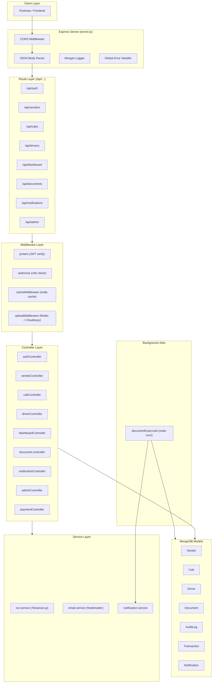
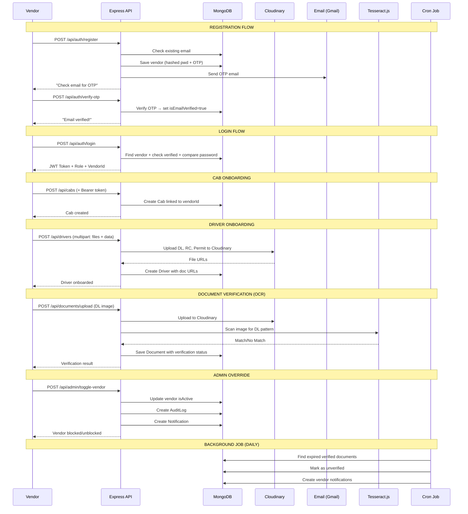

# 🚀 Cab Vendor System — Backend Deep Analysis

## 1. Architecture Overview



---

## 2. Database Models

| Model | Key Fields | Relationships |
|-------|-----------|---------------|
| **Vendor** | name, email, password, role (SuperVendor\|Regional\|City\|Local), delegatedRights, isActive, isEmailVerified, otp, otpExpires | `parentVendor` → self-ref (Vendor) |
| **Cab** | registrationNumber (unique), model, seatingCapacity, fuelType, isActive | `vendorId` → Vendor, `driverId` → Driver |
| **Driver** | name, contactNumber (unique), isActive, embedded docs (DL/RC/Permit with URL+expiry+verified) | `vendorId` → Vendor |
| **Document** | documentType (DL/RC/Permit/Pollution/Insurance), documentUrl, isVerified, expiryDate, remarks | `driverId` → Driver |
| **AuditLog** | actionType (BLOCK/UNBLOCK_VENDOR, BLOCK_CAB, APPROVE/REJECT_DOCUMENT), reason | `performedBy` → Vendor, `targetEntityId` |
| **Transaction** | amount, currency, razorpayOrderId, razorpayPaymentId, status | `vendorId` → Vendor |
| **Notification** | title, message, type (ALERT/SYSTEM/DOCUMENT/PAYMENT), isRead | `recipientId` → Vendor |

---

## 3. API Endpoints (Complete Map)

### Auth (`/api/auth`)
| Method | Route | Auth | Controller | Description |
|--------|-------|------|-----------|-------------|
| POST | `/register` | ❌ Public | `registerVendor` | Register + send OTP email |
| POST | `/verify-otp` | ❌ Public | `verifyEmailOTP` | Verify email with 6-digit OTP |
| POST | `/login` | ❌ Public | `loginVendor` | Login → JWT token + role + vendorId |

### Vendors (`/api/vendors`)
| Method | Route | Auth | Controller | Description |
|--------|-------|------|-----------|-------------|
| PUT | `/delegate/:id` | 🔒 protect | `delegateAccess` | Update sub-vendor delegation rights |

### Cabs (`/api/cabs`)
| Method | Route | Auth | Controller | Description |
|--------|-------|------|-----------|-------------|
| POST | `/` | 🔒 protect + authorize(all roles) | `addCab` | Onboard a new cab |
| GET | `/` | 🔒 protect | `getMyCabs` | Get logged-in vendor's cabs |

### Drivers (`/api/drivers`)
| Method | Route | Auth | Controller | Description |
|--------|-------|------|-----------|-------------|
| POST | `/` | 🔒 protect + authorize(all roles) + upload(3 files) | `addDriver` | Onboard driver with DL/RC/Permit uploads |

### Dashboard (`/api/dashboard`)
| Method | Route | Auth | Controller | Description |
|--------|-------|------|-----------|-------------|
| GET | `/super-vendor` | 🔒 protect + authorize(SuperVendor) + cache | `getSuperVendorDashboard` | Aggregated metrics |

### Documents (`/api/documents`)
| Method | Route | Auth | Controller | Description |
|--------|-------|------|-----------|-------------|
| POST | `/upload` | upload.single('file') | `uploadDriverDocument` | Upload doc + OCR verify (DL) |

### Notifications (`/api/notifications`)
| Method | Route | Auth | Controller | Description |
|--------|-------|------|-----------|-------------|
| GET | `/` | 🔒 protect | `getMyNotifications` | Fetch vendor's notifications |
| PUT | `/:id/read` | 🔒 protect | `markAsRead` | Mark notification as read |

### Admin (`/api/admin`)
| Method | Route | Auth | Controller | Description |
|--------|-------|------|-----------|-------------|
| POST | `/toggle-vendor` | 🔒 protect | `toggleVendorStatus` | Block/unblock vendor + audit log + notification |

---

## 4. Postman Test Journey → Backend Mapping

| # | Postman Item | Actual API | Method | Flow |
|---|-------------|-----------|--------|------|
| 1 | **Register Vendor** | `POST /api/auth/register` | POST | Creates vendor with hashed password + generates 6-digit OTP + sends email |
| 2 | **OTP Generation** | Part of registration flow | — | OTP auto-generated during registration |
| 3 | **OTP Verification** | `POST /api/auth/verify-otp` | POST | Verifies OTP → sets `isEmailVerified: true` |
| 4 | **Login** | `POST /api/auth/login` | POST | Checks email verified → returns JWT token |
| 5 | **Add Cab** | `POST /api/cabs` | POST | Auth + creates cab linked to vendor |
| 6 | **Add Driver** | `POST /api/drivers` | POST | Auth + multipart upload (DL/RC/Permit) → Cloudinary |
| 7 | **DL Verification** | `POST /api/documents/upload` | POST | Uploads doc + Tesseract.js OCR → regex DL match |
| 8 | **Get Super Vendor Dashboard** | `GET /api/dashboard/super-vendor` | GET | Auth + SuperVendor only → cached aggregation |
| 9 | **Injecting Fake Vendor** | `POST /api/auth/register` (bypass) | POST | Test creating vendor without OTP flow |
| 10 | **Audit Log** | `POST /api/admin/toggle-vendor` | POST | Block/unblock vendor → creates AuditLog entry |

---

## 5. Key Working Flow



---

## 6. Middleware Chain

```
Request → CORS → JSON Parser → Morgan Logger
  → Route Match
    → protect (JWT token verify → sets req.user)
    → authorize (role check)
    → cacheMiddleware (GET only, node-cache 5min TTL)
    → uploadMiddleware (Multer → Cloudinary)
    → Controller
  → 404 Handler
  → Global Error Handler
```

> [!IMPORTANT]
> **Inconsistency Found**: `authMiddleware.protect` sets `req.user` but some controllers (cab, driver, dashboard) use `req.vendor._id`. The `protect` middleware sets `req.user` NOT `req.vendor`. This means cab/driver/dashboard routes likely fail unless there's a mapping somewhere. The `vendorController` was already fixed to use `req.user.id`.

---

## 7. What the Frontend Needs to Integrate

Based on the backend analysis, the frontend must handle:

| Feature Area | Backend APIs Available | Frontend Pages Needed |
|-------------|----------------------|----------------------|
| **Auth** | register, verify-otp, login | Login, Register, OTP Verification |
| **Dashboard** | super-vendor dashboard | SuperVendor Dashboard, SubVendor Dashboard |
| **Cab Management** | addCab, getMyCabs | Cab List, Add Cab Form |
| **Driver Management** | addDriver (with file upload) | Driver List, Add Driver Form (with file upload) |
| **Document Verification** | uploadDocument + OCR | Document Upload, Verification Status |
| **Delegation** | delegateAccess | Delegation Panel (toggle switches) |
| **Admin Control** | toggleVendorStatus | Vendor Block/Unblock actions |
| **Notifications** | getMyNotifications, markAsRead | Notification Panel/Bell |
| **Payments** | createOrder, verifyPayment | Payment Page (Razorpay integration) |
| **Audit Logs** | Via admin actions | Audit Log viewer |

---

## 8. Ready for Frontend

✅ Backend fully analyzed and understood. I'm now ready for your frontend requirements/folder structure. I'll build a **premium Space Dark + Golden UI** with:
- 3D animations & special effects
- Glassmorphism + glowing golden borders
- Framer Motion staggered transitions
- Role-based dynamic dashboards
- Complete API integration layer
