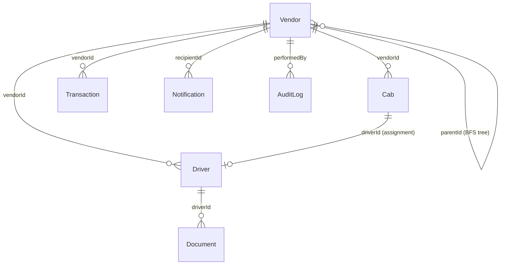

# FleetMaster — Project State & Traceability Report

> **Generated**: 2026-04-17 · **Auditor**: System Architect  
> **Stack**: MongoDB · Express · React (Vite) · Node.js · Tailwind CSS  
> **Purpose**: Master context document for LLM handoff

---

## 1. Architecture & Data Flow Map

### 1.1 Database Schemas & Relationships

| Model | Key Fields | Notes |
|-------|-----------|-------|
| **Vendor** | `name, email, password, role, currentPlan, approvalStatus, parentId, delegatedRights, isActive, isEmailVerified, otp, otpExpires` | Central entity. `role` enum: `Admin, SuperVendor, RegionalVendor, CityVendor, LocalVendor`. `currentPlan` enum: `Starter, Professional, Enterprise`. Has pre-save hook enforcing sub-vendor limits. `parentId` links to parent vendor (BFS tree). **Note**: Some legacy records use `parentVendor` — all queries use `$or` on both fields. |
| **Cab** | `registrationNumber, model, seatingCapacity, fuelType, vendorId, driverId, isActive, approvalStatus, approvalRemarks` | Pre-save hook counts cabs across entire BFS tree and enforces plan limits (Starter:10, Professional:50, Enterprise:unlimited). |
| **Driver** | `name, contactNumber, vendorId, documents{drivingLicense, registrationCertificate, permitAndPollution}, approvalStatus` | Each sub-document has `{documentUrl, expiryDate, isVerified}`. Pre-save hook enforces driver limits identical to Cab. |
| **Document** | `driverId, documentType, documentUrl, isVerified, remarks, expiryDate` | Linked to Driver, NOT directly to Vendor. OCR processing happens at upload time via Tesseract.js. |
| **Transaction** | `vendorId, amount, currency, razorpayOrderId, razorpayPaymentId, status` | Status enum: `Pending, Completed, Failed`. |
| **Notification** | `recipientId, title, message, type, isRead` | Type enum: `ALERT, SYSTEM, DOCUMENT, PAYMENT`. |
| **AuditLog** | `actionType, performedBy, targetEntityId, targetEntityType, reason` | Action types: `BLOCK_VENDOR, UNBLOCK_VENDOR, BLOCK_CAB, APPROVE_DOCUMENT, REJECT_DOCUMENT`. |

### 1.2 Hierarchy Traversal (BFS Engine)

File: [hierarchy.js](file:///c:/Users/hp/Desktop/Cab-Vendor-System/backend/utils/hierarchy.js)

Two exported functions:
- **`getDescendantVendorIds(rootVendorId)`** — Iterative BFS. Queries `Vendor.find({ $or: [{ parentId }, { parentVendor }] })` at each level. Returns array of ALL descendant ObjectIds including root. Max depth safety: governed by tree exhaustion (typically ≤5 tiers).
- **`getRootVendorId(vendorId)`** — Climbs UP the tree from any vendor to find the root SuperVendor. Safety cap: 6 iterations. Used by pre-save hooks to find the plan-owning SuperVendor.

### 1.3 Backend Controllers

| Controller | Purpose | Route Prefix |
|-----------|---------|-------------|
| [authController.js](file:///c:/Users/hp/Desktop/Cab-Vendor-System/backend/controllers/authController.js) | Register (with OTP), verify OTP, login (JWT), forgot/reset password | `/api/auth` |
| [vendorController.js](file:///c:/Users/hp/Desktop/Cab-Vendor-System/backend/controllers/vendorController.js) | Get/update profile, change password, delegate access rights | `/api/vendors` |
| [cabController.js](file:///c:/Users/hp/Desktop/Cab-Vendor-System/backend/controllers/cabController.js) | Add cab, get my cabs, assign driver to cab | `/api/cabs` |
| [driverController.js](file:///c:/Users/hp/Desktop/Cab-Vendor-System/backend/controllers/driverController.js) | Add driver (with Multer file uploads), get my drivers | `/api/drivers` |
| [document.controller.js](file:///c:/Users/hp/Desktop/Cab-Vendor-System/backend/controllers/document.controller.js) | Upload driver document (Tesseract OCR on DL), get my documents | `/api/documents` |
| [dashboardController.js](file:///c:/Users/hp/Desktop/Cab-Vendor-System/backend/controllers/dashboardController.js) | SuperVendor dashboard metrics (BFS fleet count, compliance) | `/api/dashboard` |
| [approvalController.js](file:///c:/Users/hp/Desktop/Cab-Vendor-System/backend/controllers/approvalController.js) | Get pending cabs+drivers for approval, process approve/reject with notifications | `/api/approvals` |
| [superVendorController.js](file:///c:/Users/hp/Desktop/Cab-Vendor-System/backend/controllers/superVendorController.js) | Get descendants missing docs, send bulk document reminders | `/api/super-vendor` |
| [adminController.js](file:///c:/Users/hp/Desktop/Cab-Vendor-System/backend/controllers/adminController.js) | System metrics, list SuperVendors, toggle vendor status, audit logs, approve vendor docs | `/api/admin` |
| [notificationController.js](file:///c:/Users/hp/Desktop/Cab-Vendor-System/backend/controllers/notificationController.js) | Get my notifications, mark one read, mark all read | `/api/notifications` |
| [paymentController.js](file:///c:/Users/hp/Desktop/Cab-Vendor-System/backend/controllers/paymentController.js) | Create Razorpay order, verify payment + upgrade `currentPlan` + dispatch notification | `/api/payments` |

### 1.4 Backend Services & Infrastructure

| Service/Job | File | Purpose |
|------------|------|---------|
| Email Service | `services/email.service.js` | Resend SDK for OTP delivery and password reset emails |
| OCR Service | `services/ocr.service.js` | Tesseract.js — regex-matches DL number format `[A-Z]{2}[0-9]{2}\s?[0-9]{11}` |
| Notification Service | `services/notification.service.js` | `createNotification(recipientId, title, message, type)` — shared by all controllers |
| Document Expiry Job | `jobs/documentExpiryJob.js` | `node-cron` daily at midnight — marks expired docs unverified + sends ALERT notifications |
| Auth Middleware | `middlewares/authMiddleware.js` | JWT `protect` + role-based `authorize(...roles)`. Sets both `req.user` and `req.vendor` alias. Blocks `isActive === false` vendors. |
| Upload Middleware | `middlewares/uploadMiddleware.js` | Multer config for file uploads (DL, RC, Permit) |
| Cache Middleware | `middlewares/cacheMiddleware.js` | Simple in-memory cache for dashboard endpoint |

### 1.5 Frontend Pages & Components

| Page/Component | File | State Managed | Role Access |
|---------------|------|--------------|-------------|
| **LandingPage** | `pages/LandingPage.jsx` | None (static) | Public |
| **LoginPage** | `pages/auth/LoginPage.jsx` | email, password, loading | Public |
| **RegisterPage** | `pages/auth/RegisterPage.jsx` | form fields, parentId, role selection | Public |
| **OTPPage** | `pages/auth/OTPPage.jsx` | otp digits, timer | Public |
| **ForgotPasswordPage** | `pages/auth/ForgotPasswordPage.jsx` | email, loading | Public |
| **ResetPasswordPage** | `pages/auth/ResetPasswordPage.jsx` | passwords, token | Public |
| **Dashboard** | `src/Dashboard.jsx` | loading, data (fleet/compliance/hierarchy), error | SuperVendor (Admin gets `AdminDashboard`) |
| **AdminDashboard** | `pages/admin/AdminDashboard.jsx` | metrics (roles, cabs, drivers) | Admin |
| **VendorListPage** | `pages/admin/VendorListPage.jsx` | vendors list, toggle status modals | Admin |
| **AuditLogsPage** | `pages/admin/AuditLogsPage.jsx` | logs list, filters | Admin |
| **SuperVendorApprovals** | `pages/admin/SuperVendorApprovals.jsx` | pendingVendors, approvingId | Admin |
| **CabListPage** | `pages/cabs/CabListPage.jsx` | cabs list | All vendors |
| **AddCabPage** | `pages/cabs/AddCabPage.jsx` | form fields | All vendors |
| **DriverListPage** | `pages/drivers/DriverListPage.jsx` | drivers list | All vendors |
| **AddDriverPage** | `pages/drivers/AddDriverPage.jsx` | form fields + file uploads | All vendors |
| **DocumentListPage** | `pages/documents/DocumentListPage.jsx` | documents list, upload modal | All vendors |
| **PaymentPage** | `pages/payments/PaymentPage.jsx` | processing planId, paymentSuccess | All vendors |
| **ProfilePage** | `pages/profile/ProfilePage.jsx` | user data, edit form, password change | All vendors |
| **NotificationsPage** | `pages/notifications/NotificationsPage.jsx` | notifications list | All vendors |
| **SubVendorList** | `pages/subvendors/SubVendorList.jsx` | vendors array, search filter | SuperVendor |
| **PendingDocumentApprovals** | `pages/approvals/PendingDocumentApprovals.jsx` | queue, selectedId, processing, rejectModal | SuperVendor, Admin |
| **MissingDocsPanel** | `pages/approvals/MissingDocsPanel.jsx` | vendors, selected (Set), sending | SuperVendor (embedded in PendingDocumentApprovals) |
| **Topbar** | `components/layout/Topbar.jsx` | userName (fetched from API) | All roles |
| **Sidebar** | `components/layout/Sidebar.jsx` | None (reads role from AuthContext) | All roles (different links per role) |
| **NotificationDropdown** | `components/notifications/NotificationDropdown.jsx` | items, open, markingId | All roles |

---

## 2. Traceability Matrix (Frontend → Backend Wiring)

### 2.1 Authentication Flow

| Frontend Component | Action | HTTP Method | Backend Route | Controller Function |
|-------------------|--------|-------------|--------------|-------------------|
| `RegisterPage.jsx` | Submit registration form | `POST` | `/api/auth/register` | `authController.registerVendor` |
| `OTPPage.jsx` | Verify email OTP | `POST` | `/api/auth/verify-otp` | `authController.verifyEmailOTP` |
| `LoginPage.jsx` | Login with credentials | `POST` | `/api/auth/login` | `authController.loginVendor` |
| `ForgotPasswordPage.jsx` | Request password reset | `POST` | `/api/auth/forgot-password` | `authController.forgotPassword` |
| `ResetPasswordPage.jsx` | Set new password | `POST` | `/api/auth/reset-password` | `authController.resetPassword` |

### 2.2 Vendor Profile & Access

| Frontend Component | Action | HTTP Method | Backend Route | Controller Function |
|-------------------|--------|-------------|--------------|-------------------|
| `Topbar.jsx` | Fetch logged-in user name | `GET` | `/api/vendors/me` | `vendorController.getMyProfile` |
| `ProfilePage.jsx` | Load profile data | `GET` | `/api/vendors/me` | `vendorController.getMyProfile` |
| `ProfilePage.jsx` | Update name/email | `PATCH` | `/api/vendors/me` | `vendorController.updateMyProfile` |
| `ProfilePage.jsx` | Change password | `PUT` | `/api/vendors/me/password` | `vendorController.changeMyPassword` |

### 2.3 Fleet Management (Cabs & Drivers)

| Frontend Component | Action | HTTP Method | Backend Route | Controller Function |
|-------------------|--------|-------------|--------------|-------------------|
| `AddCabPage.jsx` | Onboard new cab | `POST` | `/api/cabs` | `cabController.addCab` |
| `CabListPage.jsx` | List vendor's cabs | `GET` | `/api/cabs` | `cabController.getMyCabs` |
| `AddDriverPage.jsx` | Onboard new driver + upload docs | `POST` | `/api/drivers` | `driverController.addDriver` |
| `DriverListPage.jsx` | List vendor's drivers | `GET` | `/api/drivers` | `driverController.getMyDrivers` |

### 2.4 Documents & OCR

| Frontend Component | Action | HTTP Method | Backend Route | Controller Function |
|-------------------|--------|-------------|--------------|-------------------|
| `DocumentListPage.jsx` | List my documents | `GET` | `/api/documents` | `document.controller.getMyDocuments` |
| `DocumentListPage.jsx` | Upload document (OCR processed) | `POST` | `/api/documents/upload` | `document.controller.uploadDriverDocument` |

### 2.5 SuperVendor Dashboard & Hierarchy

| Frontend Component | Action | HTTP Method | Backend Route | Controller Function |
|-------------------|--------|-------------|--------------|-------------------|
| `Dashboard.jsx` | Fetch SV dashboard metrics | `GET` | `/api/dashboard/super-vendor` | `dashboardController.getSuperVendorDashboard` |
| `SubVendorList.jsx` | Fetch sub-vendor list (from dashboard data) | `GET` | `/api/dashboard/super-vendor` | `dashboardController.getSuperVendorDashboard` |

### 2.6 Document Approvals (SuperVendor + Admin)

| Frontend Component | Action | HTTP Method | Backend Route | Controller Function |
|-------------------|--------|-------------|--------------|-------------------|
| `PendingDocumentApprovals.jsx` | Fetch pending cabs + drivers | `GET` | `/api/approvals/pending` | `approvalController.getPendingApprovals` |
| `PendingDocumentApprovals.jsx` | Approve a cab/driver | `PUT` | `/api/approvals/:entityType/:id` | `approvalController.processApproval` |
| `PendingDocumentApprovals.jsx` | Reject a cab/driver (with remarks) | `PUT` | `/api/approvals/:entityType/:id` | `approvalController.processApproval` |

### 2.7 SuperVendor Compliance Tools

| Frontend Component | Action | HTTP Method | Backend Route | Controller Function |
|-------------------|--------|-------------|--------------|-------------------|
| `MissingDocsPanel.jsx` | Fetch descendants missing docs | `GET` | `/api/super-vendor/descendants-missing-docs` | `superVendorController.getDescendantsMissingDocs` |
| `MissingDocsPanel.jsx` | Send bulk document reminders | `POST` | `/api/super-vendor/send-document-reminder` | `superVendorController.sendDocumentReminder` |

### 2.8 Admin Panel

| Frontend Component | Action | HTTP Method | Backend Route | Controller Function |
|-------------------|--------|-------------|--------------|-------------------|
| `AdminDashboard.jsx` | Fetch system metrics | `GET` | `/api/admin/metrics` | `adminController.getSystemMetrics` |
| `SuperVendorApprovals.jsx` | Fetch all vendors (filters pending SVs) | `GET` | `/api/admin/vendors` | `adminController.getAllGlobalVendors` |
| `SuperVendorApprovals.jsx` | Approve SuperVendor documents | `PUT` | `/api/admin/approve-vendor/:id` | `adminController.approveVendorDocument` |
| `VendorListPage.jsx` | Fetch all global vendors | `GET` | `/api/admin/vendors` | `adminController.getAllGlobalVendors` |
| `VendorListPage.jsx` | Block/unblock vendor | `PUT` | `/api/admin/toggle-vendor/:id` | `adminController.toggleVendorStatus` |
| `AuditLogsPage.jsx` | Fetch audit logs | `GET` | `/api/admin/audit-logs` | `adminController.getAuditLogs` |

### 2.9 Notifications

| Frontend Component | Action | HTTP Method | Backend Route | Controller Function |
|-------------------|--------|-------------|--------------|-------------------|
| `NotificationDropdown.jsx` | Fetch notifications | `GET` | `/api/notifications` | `notificationController.getMyNotifications` |
| `NotificationDropdown.jsx` | Mark one as read | `PUT` | `/api/notifications/:id/read` | `notificationController.markAsRead` |
| `NotificationDropdown.jsx` | Mark all as read | `PUT` | `/api/notifications/read-all` | `notificationController.markAllAsRead` |
| `NotificationsPage.jsx` | Full-page notifications view | `GET` | `/api/notifications` | `notificationController.getMyNotifications` |

### 2.10 Payments

| Frontend Component | Action | HTTP Method | Backend Route | Controller Function |
|-------------------|--------|-------------|--------------|-------------------|
| `PaymentPage.jsx` | Create Razorpay order | `POST` | `/api/payments/create-order` | `paymentController.createOrder` |
| `PaymentPage.jsx` | Verify payment signature | `POST` | `/api/payments/verify` | `paymentController.verifyPayment` |

---

## 3. The "Orphan" Audit (Critical Analysis)

### 3.1 Backend Orphans (API Endpoints with NO Frontend Consumer)

| # | Route | Method | Controller | Severity | Issue |
|---|-------|--------|-----------|----------|-------|
| **B-1** | `/api/cabs/:id/assign-driver` | `PUT` | `cabController.assignDriverToCab` | 🟡 Medium | **No UI exists** to assign a driver to a cab. `CabListPage` lists cabs but has no "Assign Driver" button or modal. |
| **B-2** | `/api/admin/super-vendors` | `GET` | `adminController.getAllSuperVendors` | 🟢 Low | Endpoint defined in `endpoints.js` as `ADMIN.SUPER_VENDORS` but **no component** calls it. `SuperVendorApprovals` uses `ADMIN.GET_VENDORS` and filters client-side instead. This is a dead endpoint. |
| **B-3** | `/api/vendors/delegate/:id` | `PUT` | `vendorController.delegateAccess` | 🔴 High | **No delegation UI exists anywhere.** The backend fully supports toggling `canOnboardCab, canOnboardDriver, canProcessPayments` per sub-vendor, but `SubVendorList.jsx` is read-only — no "Manage Rights" buttons. This is a **major feature gap**. |
| **B-4** | `vendorSchema.pre('save')` hook | — | Vendor model | 🟡 Medium | The Starter plan's sub-vendor limit check (`subVendorCount >= 0`) will **always block** new sub-vendor creation on Starter — even the first one. This is correct per spec (Starter = 0 sub-vendors), but there's no frontend UI to surface the "upgrade your plan" error gracefully. |
| **B-5** | `Cab/Driver pre('save')` hooks | — | Cab/Driver models | 🟡 Medium | Plan limit errors thrown by Mongoose hooks will surface as generic 500 errors. No frontend toast or error handler is specifically parsing "Plan Limit" error messages from `.save()` failures. |
| **B-6** | `documentExpiryJob.js` (Cron) | — | Background job | 🟢 Low | Runs silently at midnight. No admin dashboard widget shows "Documents expiring soon" or historical expiry counts. Works correctly but is invisible to the user. |

### 3.2 Frontend Orphans (UI with NO Backend or Broken Wiring)

| # | Component | Element | Severity | Issue |
|---|-----------|---------|----------|-------|
| **F-1** | `PaymentPage.jsx` | Verify payment handler (line 111) | 🔴 High | **Does NOT send `planName`** to the backend. The `verifyPayment` backend now accepts `planName` in `req.body` and upgrades `currentPlan`, but the frontend sends only `{razorpay_order_id, razorpay_payment_id, razorpay_signature}` — **missing `planName: plan.name`**. The plan upgrade will silently not happen. |
| **F-2** | `SubVendorList.jsx` | "Active Cabs" column (line 210-212) | 🟡 Medium | Hardcoded as `N/A`. The dashboard API returns fleet counts but not per-vendor cab counts. Would require a new aggregation endpoint or a `$lookup` in the existing query. |
| **F-3** | `PendingDocumentApprovals.jsx` | Document Image Viewer (left pane) | 🟡 Medium | The `DocImageViewer` attempts to render `item.documents?.drivingLicense?.documentUrl` for drivers. This URL points to a **local Multer path** (e.g., `uploads/abc123.jpg`). Unless the Express server serves the `/uploads` directory as static files, these images will 404 in the browser. Cab entities have **no image URL** at all — the viewer will always show the placeholder. |
| **F-4** | `PendingDocumentApprovals.jsx` | "OCR Extracted Data" panel | 🟢 Low | Displays `approvalStatus` and basic fields from the Cab/Driver model, but **not actual OCR results**. The OCR data (DL number extracted by Tesseract) is stored in the `Document` collection, not on the `Driver` object directly. Would need a join/populate to show real OCR output. |
| **F-5** | `Dashboard.jsx` | Lower-tier vendor dashboard | 🟡 Medium | If the logged-in user is NOT a SuperVendor and NOT Admin (e.g., CityVendor, LocalVendor), the dashboard API call to `/api/dashboard/super-vendor` will return 403. There is **no separate dashboard endpoint** for non-SuperVendor roles. These users see an error screen. |
| **F-6** | `AdminDashboard.jsx` | Admin dashboard | 🟢 Low | Calls `ADMIN.METRICS` which returns `rolesBreakdown, totalGlobalCabs, totalGlobalDrivers`. No widget currently displays `totalGlobalDrivers` — this is an informational gap only. |

### 3.3 Configuration Issues Found

| # | File | Issue | Severity |
|---|------|-------|----------|
| **C-1** | `server.js` line 79 | `adminRoutes` is mounted **twice**: once at line 76 and again at line 79. This causes route duplication. No functional break but wasteful. | 🟢 Low |
| **C-2** | `server.js` line 51-54 | CORS `origin` is a single string from env. Earlier we discussed updating to an array for multi-port Vite dev, but it's back to a single value. If Vite auto-selects port 5174, requests will fail. | 🟡 Medium |
| **C-3** | `AuditLog.js` | `actionType` enum includes `APPROVE_DOCUMENT` but the `approvalController.processApproval` does **not** create AuditLog entries when approving/rejecting cabs/drivers. Only admin-level vendor approval creates audit logs. | 🟡 Medium |

---

## 4. Summary: Priority Action Items

### 🔴 Critical (Broken Functionality)

| ID | Fix Required |
|----|-------------|
| **F-1** | `PaymentPage.jsx` line 111 → Add `planName: plan.name` to the verify POST body. Without this, payment works but **no plan upgrade happens**. |
| **B-3** | Build a "Manage Delegation Rights" modal in `SubVendorList.jsx` wired to `PUT /api/vendors/delegate/:id`. The backend is ready, the UI is missing. |

### 🟡 Medium (Feature Gaps)

| ID | Work Needed |
|----|-------------|
| **B-1** | Add "Assign Driver" dialog in CabListPage, calling `PUT /api/cabs/:id/assign-driver`. |
| **F-5** | Create a `/api/dashboard/vendor` endpoint for non-SuperVendor roles, or gate the Dashboard UI to show a simplified view. |
| **B-4/B-5** | Add frontend error parsing for Mongoose plan-limit errors — display a toast like "Upgrade your plan to add more cabs/drivers". |
| **F-2** | Replace `N/A` cab count in SubVendorList with real data (requires backend aggregation). |
| **F-3** | Serve `/uploads` as static files in Express, or migrate uploads to Cloudinary URLs. |
| **C-2** | Restore CORS array: `origin: ['http://localhost:5173', 'http://localhost:5174', process.env.FRONTEND_URL]`. |
| **C-3** | Add AuditLog creation to `processApproval` in `approvalController.js`. |

---

## 5. The Gemini Handoff Summary

**FleetMaster** is a MERN SaaS fleet management platform with a 5-tier RBAC hierarchy (Admin → SuperVendor → Regional → City → LocalVendor) where vendor parentage is tracked via `Vendor.parentId` (with legacy `parentVendor` dual-field support) and traversed using a custom iterative BFS utility (`utils/hierarchy.js`). The backend exposes 11 route files (32 endpoints total) covering auth (register→OTP→login with hashed OTP + Resend email), CRUD for Cabs/Drivers with Multer file uploads and Tesseract.js OCR on driving licenses, a SuperVendor dashboard with BFS-powered fleet/compliance metrics, a hierarchical document approval queue with post-action notification dispatch, proactive compliance tools (descendants-missing-docs + bulk reminder notifications), admin oversight (global vendor management, block/unblock with AuditLog, SuperVendor document approval), Razorpay payment integration (order creation + crypto signature verification that now upgrades `Vendor.currentPlan`), and Mongoose pre-save hooks on Vendor/Cab/Driver models that enforce tiered plan limits (Starter:10/10/0, Professional:50/50/∞, Enterprise:∞) by climbing the BFS tree to the root SuperVendor. The React frontend (Vite + Tailwind, dark "Space" theme with gold accents) has 20+ pages/components including split-pane document approvals with image viewer/zoom/fullscreen and rejection-reason modal, a collapsible MissingDocsPanel with select-all checkboxes and bulk notification dispatch, and role-gated routing via `ProtectedRoute` + `RoleBasedRoute`. **Critical gaps remaining**: (1) `PaymentPage.jsx` does NOT send `planName` during payment verification so plan upgrades silently fail, (2) delegation rights UI (`PUT /api/vendors/delegate/:id`) has a complete backend but zero frontend, (3) assign-driver-to-cab API has no UI, (4) non-SuperVendor vendor roles have no dashboard endpoint and will see a 403 error, (5) CORS is single-origin and will break on alternative Vite ports, (6) Express does not serve `/uploads` as static files so document images 404 in the browser.
