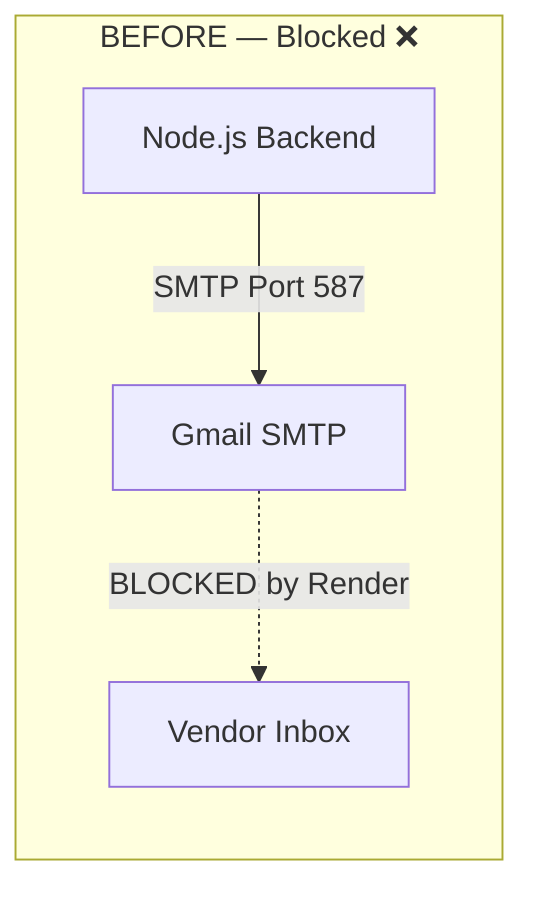
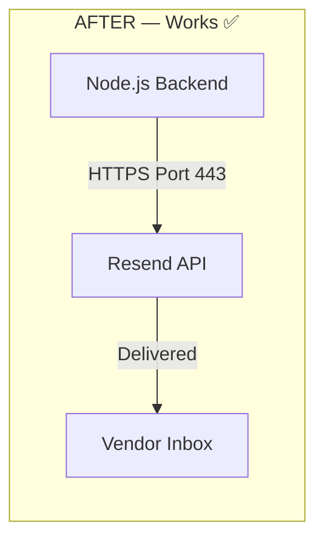

# Resend Email Migration — Complete Walkthrough

## Problem
Render's Free Tier **blocks outbound TCP on SMTP ports** (25, 465, 587). Nodemailer will always fail with `ETIMEDOUT on CONN` regardless of any workaround.

## Solution
Replaced Nodemailer (SMTP) with **Resend SDK** (HTTPS on port 443, which Render does NOT block).

---

## What Changed

### [MODIFIED] [email.service.js](file:///c:/Users/hp/Desktop/Cab-Vendor-System/backend/services/email.service.js)
- **Completely removed** `nodemailer` import and SMTP transporter
- **Added** `resend` SDK with `resend.emails.send()` (uses HTTPS)
- Both `sendOTPVerificationEmail` and `sendPasswordResetEmail` still return `true`/`false` — **identical contract**
- All HTML email templates preserved exactly as they were

### [MODIFIED] [.env.example](file:///c:/Users/hp/Desktop/Cab-Vendor-System/backend/.env.example)
- Replaced `EMAIL_USER` / `EMAIL_PASS` with `RESEND_API_KEY` / `RESEND_FROM_EMAIL`

### [MODIFIED] [authController.js](file:///c:/Users/hp/Desktop/Cab-Vendor-System/backend/controllers/authController.js)
- Updated one comment (line 48). **Zero logic changes.**

### NOT Modified (no changes needed)
- `vendorController.js` — already works with the same function signature ✅
- `authController.js` logic — rollback on `emailSent === false` still works perfectly ✅

---

## Your Step-by-Step Instructions

### Step 1 — Install Resend, Uninstall Nodemailer

Run this in your `backend/` directory:

```bash
npm install resend
npm uninstall nodemailer
```

### Step 2 — Get Your Resend API Key

1. Go to [https://resend.com](https://resend.com) and sign up (free tier = **100 emails/day** — more than enough)
2. Go to **API Keys** → **Create API Key** → copy it

### Step 3 — Update Your `.env` File

Open `backend/.env` and make these changes:

```diff
- EMAIL_USER=yourgmail@gmail.com
- EMAIL_PASS=your-app-password

+ RESEND_API_KEY=re_xxxxxxxxxxxxxxxxxxxxxxxxxxxx
+ RESEND_FROM_EMAIL=FleetMaster <onboarding@resend.dev>
```

> [!IMPORTANT]
> **For testing:** Use `onboarding@resend.dev` as the from address — Resend provides this for free, no domain verification needed.
>
> **For production:** Verify your own domain on Resend (e.g., `noreply@fleetmaster.com`) and update `RESEND_FROM_EMAIL`.

### Step 4 — Update Render Environment Variables

In your **Render Dashboard → Environment**:
1. **Delete** `EMAIL_USER` and `EMAIL_PASS`
2. **Add** `RESEND_API_KEY` = your key from Step 2
3. **Add** `RESEND_FROM_EMAIL` = `FleetMaster <onboarding@resend.dev>` (or your verified domain)
4. Click **Save Changes** → Render will auto-redeploy

### Step 5 — Test

Register a new vendor and verify that:
- ✅ OTP email is received
- ✅ No `ETIMEDOUT` errors in Render logs
- ✅ Failed email still triggers vendor rollback (delete from DB)

---

## Why Resend Over Alternatives?

| Feature | Resend | SendGrid | Brevo |
|---------|--------|----------|-------|
| **Protocol** | HTTPS (443) ✅ | HTTPS (443) ✅ | HTTPS (443) ✅ |
| **Free Tier** | 100 emails/day | 100 emails/day | 300 emails/day |
| **SDK Simplicity** | 3 lines of code | More boilerplate | More boilerplate |
| **Speed to setup** | < 2 minutes | ~10 minutes | ~10 minutes |
| **No domain needed** | ✅ (test sender) | ❌ | ❌ |

> [!NOTE]
> All three alternatives would work. Resend was chosen for the simplest SDK and instant testing without domain verification.

---

## Architecture Before & After




